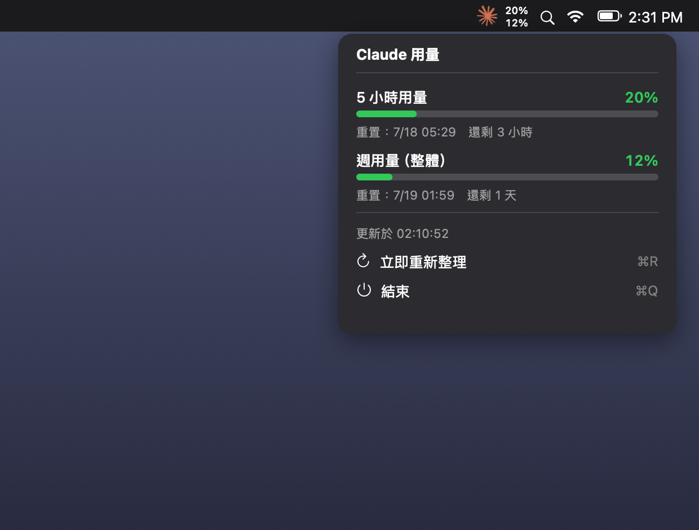

# Claude Usage（選單列）

[English](README.md) · **繁體中文**

一個小巧的 macOS 選單列 app，讓你一眼看到目前的 Claude 訂閱用量 —— 不用再打開設定選單。



選單列是精簡的兩行式顯示：

```
[圖示]  20%
        12%
```

上面是 5 小時用量、下面是週用量，不需要文字標籤。點開看完整明細，有彩色進度條與重置時間：

- **5 小時**用量（滾動的短時段限制）
- **週**用量（整體）
- 各模型的週用量（例如 **Fable**）—— 只在你的方案真的有這個額度時才顯示，
  換方案後會自動消失，不會留下沒意義的數字
- **Credit 用量** —— 在你啟用 Credit 時顯示（Pro 方案用進階模型是扣 Credit，
  而不是有獨立額度）

進度條顏色：綠（< 50%）、橙（50–79%）、紅（≥ 80%）。每 5 分鐘自動更新。app 只存在於選單列（不佔 Dock），並會在登入時自動啟動。介面雙語:會依你的 macOS 系統語言自動顯示英文或繁體中文。

## 系統需求

- **macOS 12 以上**
- **Xcode Command Line Tools**（提供 `swiftc`）：`xcode-select --install`
- 已安裝並**登入**的**桌面版 Claude app**（本程式會讀取它在本機的登入狀態來驗證 —— 見下方「運作原理」）

## 安裝

### 方式 A — Homebrew（推薦）

```bash
brew install realhere/tap/claude-usage
brew services start realhere/tap/claude-usage
```

會在你的 Mac 上從原始碼建置，所以完全不會被 Gatekeeper 擋，`brew services` 也會讓它
在登入時自動啟動。之後用 `brew upgrade claude-usage` 更新。

### 方式 B — 手動從原始碼建置

需要 Xcode Command Line Tools（`xcode-select --install`）。

```bash
git clone https://github.com/realhere/claude-usage-menubar.git
cd claude-usage-menubar
./install.sh
```

腳本會建置一個小巧的 `.app`、安裝到 `~/Applications`，並設定 LaunchAgent 讓它在登入時
自動啟動、當機時自動重啟。因為是在本機編譯，同樣不會被 Gatekeeper 擋。

### 方式 C — 下載預先建置好的 app

1. 從 [最新 release](https://github.com/realhere/claude-usage-menubar/releases/latest) 下載 `ClaudeUsage-v1.1-macos.zip` 並解壓縮。
2. 把 `ClaudeUsage.app` 移到 `/Applications`。
3. 首次開啟：**在 app 上按右鍵 → 打開 → 打開**。本程式開源但未經 Apple 公證，所以
   Gatekeeper 會警告一次。（或到「系統設定 → 隱私權與安全性 → 仍要打開」。）
   方式 A 和 B 完全沒有這個問題。
4. 想要登入時自動啟動，到「系統設定 → 一般 → 登入項目」加入它。

首次更新時 macOS 會要求鑰匙圈存取權（讓 app 讀取 Claude 桌面版的 cookie）—— 按**允許**即可。

## 解除安裝

如果你是用 Homebrew 安裝的：

```bash
brew services stop realhere/tap/claude-usage
brew uninstall claude-usage
```

其他方式則在 clone 下來的資料夾裡執行：

```bash
./uninstall.sh
```

## 運作原理

Claude 沒有公開的用量 API，所以本程式讀取和 Claude 網頁版相同的資料：

1. 從 `~/Library/Application Support/Claude/Cookies`（本機的 SQLite 檔）讀取桌面版 Claude app 的 **cookie**，並用 macOS **登入鑰匙圈**裡的 *「Claude Safe Storage」* 金鑰解密 —— 這和 Chrome／Electron app 處理自己 cookie 的機制相同。
2. 帶著這些 cookie 呼叫**官方的** `claude.ai` 用量端點（`/api/organizations/{org}/usage`，正是網頁版使用的那個），取回你的用量百分比。

## 隱私與安全

- 你的 session key **只會**送往 `claude.ai` 官方端點，**絕不**存到磁碟、**絕不**送往其他任何地方。
- 本機只會寫入一份「最後一次各模型百分比」的小快取（`~/ClaudeUsage/model_cache.json`）與一個選用的除錯 log —— 不含任何憑證。
- 這個 app 做的每一件事都在這個 repo 裡。讀一下 `usage_helper.py`（約 150 行）—— 很短、可自行審閱。

## 限制與已知問題

- **僅支援 macOS。**
- **需要安裝並登入桌面版 Claude app。**
- 使用的是**未公開**的 `claude.ai` 端點，隨時可能改版或失效 —— 這是非官方工具的本質。若用量讀不到，可能是 API 改了；可對照網頁版的開發者工具 Network 分頁確認端點。
- 驗證依賴桌面版 app 維持它的 Cloudflare clearance cookie。如果你長時間完全關閉桌面版 Claude app，選單列可能短暫顯示錯誤，重新打開它即可恢復。
- `usage_helper.py` 裡寫死的 **User-Agent** 對應某個桌面版 app 版本。桌面版大版本更新後，你可能需要更新 `usage_helper.py` 最上方的 `UA` 字串。

## 自訂

- 更新頻率：改 `main.swift` 裡的 `refreshInterval`。
- 選單列圖示：換掉 `ClaudeMark.png`（或在 `main.swift` 的 `renderButtonImage()`
  裡改用其他 SF Symbol）。合成後的圖片是樣板圖示（`isTemplate = true`），只有形狀
  （alpha）算數，顏色不重要——會自動變單色、依深淺色選單列自動換黑白，跟其他系統
  圖示一致。
- 改完後重新建置：`./install.sh`。

## 疑難排解

**選單列顯示 `!` /「keychain access denied」** — app 需要一次性授權,才能讀取 Claude 桌面版存在鑰匙圈的 Safe Storage 金鑰。在終端機執行:

```bash
security find-generic-password -w -s "Claude Safe Storage" -a "Claude Key" >/dev/null 2>&1
security find-generic-password -w -s "Claude Safe Storage" -a "Claude" >/dev/null 2>&1
```

跳出視窗時點「**總是允許**」,再到選單點「**立即重新整理**」(或結束後重開)。金鑰的帳號名在不同版本是 `Claude` 或 `Claude Key`,app 會自動兩個都試。

**「keychain key not found」/「not logged in」** — 打開 Claude 桌面版 app 並登入,它會建立本 app 要讀的金鑰與 cookie。

**「auth failed (HTTP 401/403)」** — 重新登入 Claude 桌面版;或桌面版大版本更新後,`usage_helper.py` 最上面的 `UA` 字串可能需要更新。

## 授權

MIT —— 見 [LICENSE](LICENSE)。

## 免責聲明

本專案與 Anthropic 無關，未經其授權或背書。「Claude」是 Anthropic 的商標，選單列圖示
（`ClaudeMark.png`）改編自 Anthropic 的標誌，這裡使用它純粹是為了讓工具一眼就能看出跟
Claude 有關，並不代表這是 Anthropic 官方產品。這是一個非官方、供個人使用的工具，只從
你自己的機器讀取你自己帳號的用量。使用風險自負；你必須自行遵守 Anthropic 的服務條款。
